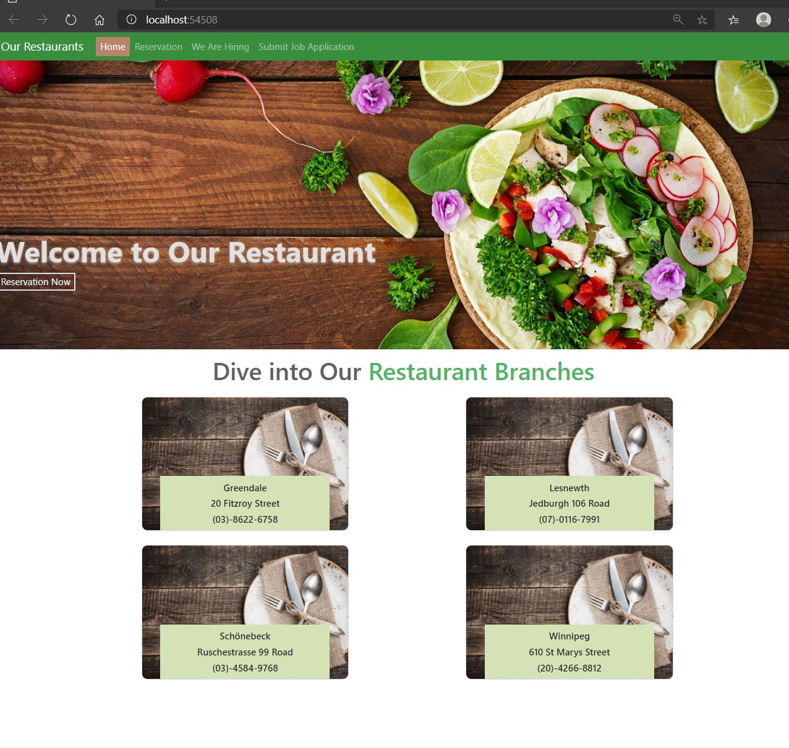
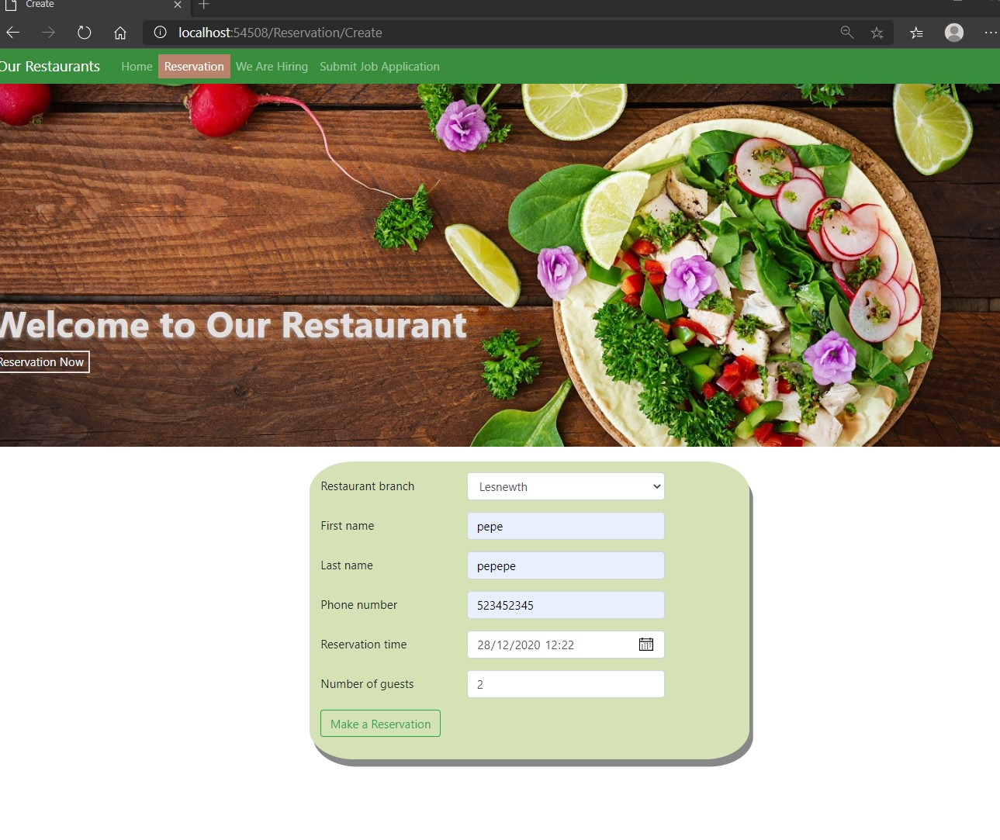
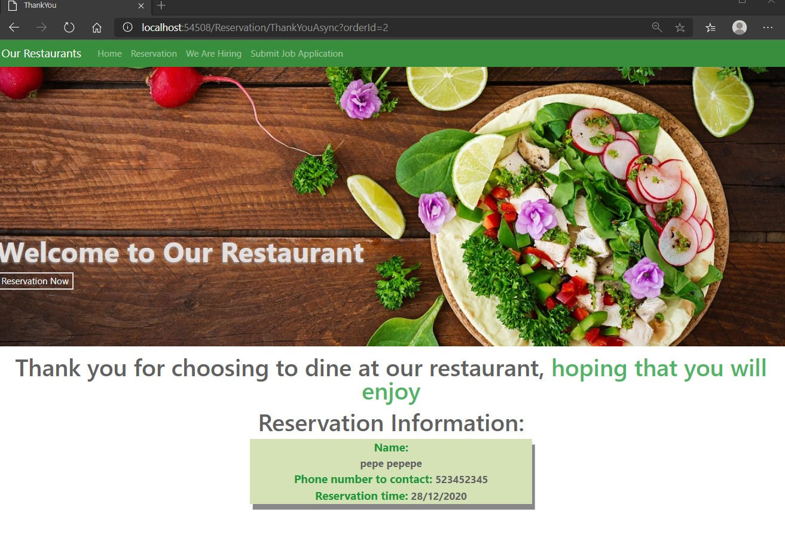

# Module 13: Implementing Web APIs

## Lab: Implementing Web APIs

1. **Nombres y apellidos:** Francisco Javier Moreno Quevedo
2. **Fecha:** 28/12/2020
3. **Resumen del Ejercicio:** implementarla web Api y sus respectivas llamadas desde Jquery o desde Httpclient en el proyecto 1/3
4. **Dificultad o problemas presentados y como se resolvieron:** Ninguna

Ejercicio 2: Calling a Web API by using Server-Side Code

- En el Middleware registramos el servicio httpClient

- En el **RestaurantBranchesController** creamos su constructor e inyectamos el httpclient 

- Cambiamos el **launchSettings** para que no lance el browser y ejecutamos

  

  

- Añadimos del lado del cliente el controlador **ReservationController**
  - Añadimos su constructor y la accion get Create, post CreatePostAsync,  PopulateRestaurantBranchesDropDownListAsync y ThankYouAsync
- Ejecutamos 

